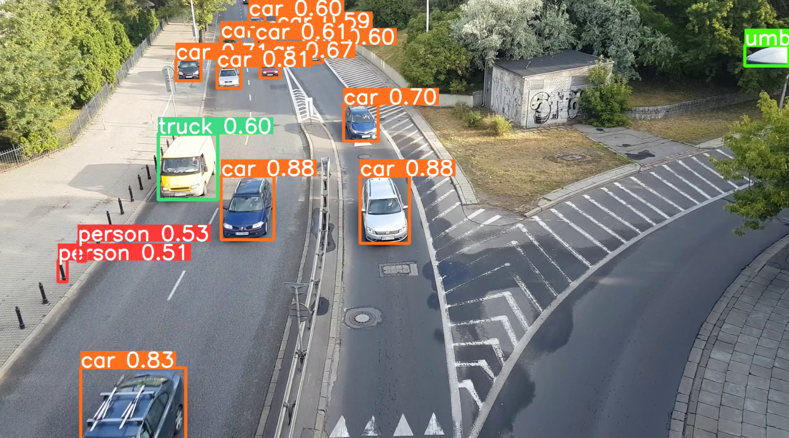

# Project_yolov8_cls_flask

Yolov8 객체감지 및 모니터링 결과 Flask_Web 배포 모델 생성 

   
## Object

Flask는 웹 애플리케이션을 구축하는 데 필요한 핵심 기능을 제공합니다.

Ultralytics의 YOLOv8 모델은 객체 감지를 위한 딥러닝 알고리즘으로 이미지나 비디오에서 객체를 감지하고 분류하는 데 사용됩니다.

본 모델은 Flask를 사용하여 YOLO 모델을 웹 애플리케이션으로 배포하는 과정을 테스트합니다.
   

   
## Pre_model

이 API에서 사용되는 모델은 COCO(Common Objects in Context) 데이터셋을 통해 사전 학습된 모델입니다.

COCO 데이터 세트는 대규모 객체 감지, 분할 및 캡션 데이터 세트입니다. 

이는 다양한 객체 범주에 대한 연구를 위해 설계되었으며 일반적으로 컴퓨터 비전 모델을 분류 및 벤치마킹하는 데 사용됩니다.

모델에 대한 자세한 설명은 아래 모델 설명서를 참고하여 주시기 바랍니다.

[링크] https://docs.ultralytics.com/datasets/detect/coco/#sample-images-and-annotations

   
## Libraries used / Version

- Flask 3.0.3
- opencv-python 4.9.0.80
- ultralytics 8.1.47
- jsonify

   
## Result

